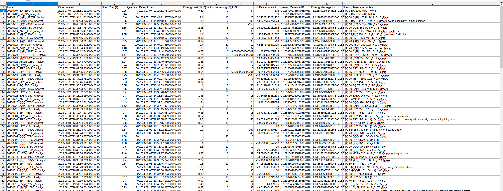

# Discord-TWS-Demo
- A showcase repository displaying project snippets aimed at demonstrating my programming proficiency, intending to secure interviews as an entry-level developer. As a result, users will not be able to clone and run the app. 

## High-Level Flowchart ##

## About the Project ##
- The app acts as a bridge between Discord and the broker IBKR TWS software. Options are ordered according to the alerted messages sent from Discord channels.  
- Console-based application developed in an object-oriented programming style. 
- Developed a Chrome extension to count the number of new messages alerted and post a JSON object to a custom RESTful API endpoint using Python Flask. The application reads the JSON object and retrieves message objects using Discord's API according to the number of new messages alerted. 
- Implemented logic of parsing open/close message alerts into options contracts details for each Discord channel. Implemented 4 different channels so far. 
- Utilized the IBKR TWS API to automatically place trades according to the options contracts details passed from above. 
  - Video demo below shows how the options orders take place. 
- Unit tested the logic to ensure the application is free of bugs and prevent converting to unexpected options contracts.

## Video Demo ##
- Video demo of placing trades according to Discord alerts and automatically logging in Google Spreadsheets. 
  - https://youtu.be/TVnSCbLO52g
## Backtesting ##
- **As this repository is a demo version, backtesting will not run without Discord message JSON data present in backtester/message_data**. 
- Able to back test alerts within a channel to determine total profit and loss (PnL). Important to backtest to minimizes losses. 
- Run backtester/get_message_data.py by selecting the analyst to retrieve message data in a Discord channel. 
- Then run backtester/backtest.py by selecting the same analyst as above to back test and generate a csv file like the example below. 

### Example ###
- Check csv_files/backtests/Example.csv for full data
- 